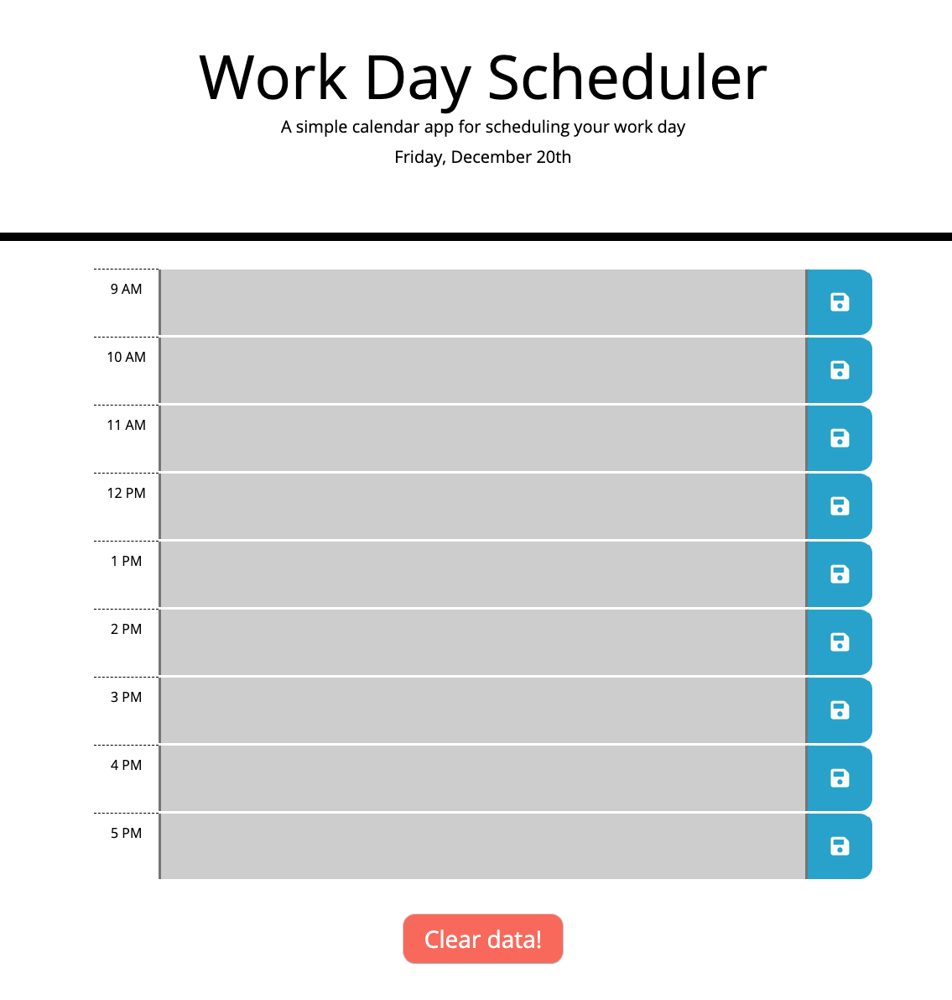

# Unit 05 Third-Party APIs Homework: Day Planner

This simple calendar application shows the current day and allows the user to save events for each hour of a normal business day (9 a.m. to 5 p.m.).  The time blocks update their color based on what time of day it is.  

This app takes advantage of the Moment.JS API for date functions and the browsers local storage for storing all the input values, as well as JQuery for JavaScript functionality and Bootstrap for styling.

---

## Motivation

This website was created for a homework project for the _[Web Developer Coding Bootcamp](https://techbootcamps.utexas.edu/coding/)_ at the University of Texas in Austin. 

## Link & Screenshot

[Deployed Application Link On Github](https://luke2theduke.github.io/05-Day-Planner/)

## User Story

AS AN employee with a busy schedule

I WANT to add important events to a daily planner

SO THAT I can manage my time effectively 

## Business Context

Poor time management can result in missed meetings and deadlines or create the appearance of unprofessionalism. A daily planner allows employees to see their day at a glance, schedule time effectively, and improve productivity. 

## Links To Resources Used For This Project

* [Moment.js](https://momentjs.com/)
* [Bootstrap CSS](https://getbootstrap.com/)
* [JQuery](https://jquery.com/)